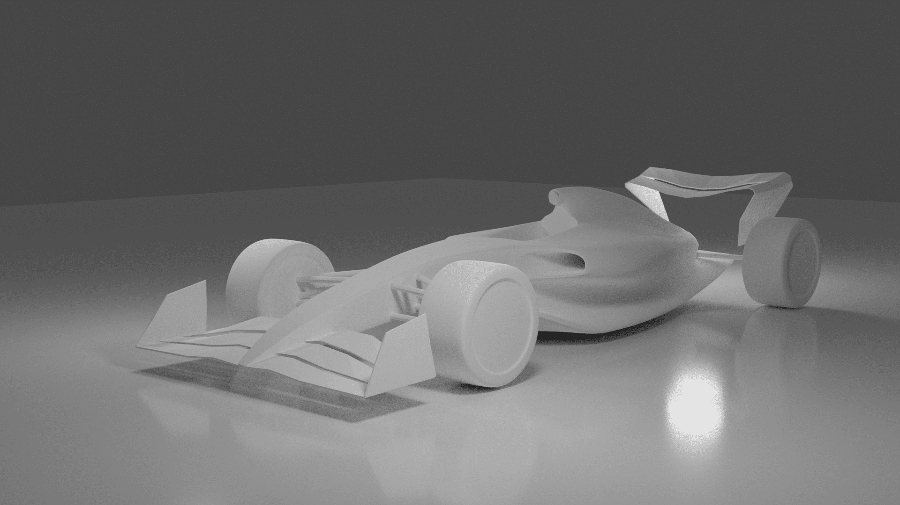

## AR/VR

Notes:

- AR is not available in iOS
- Use WASD to move around
- Click and drag to look around

## 3D Model

Progress:

At this point the mesh was a mess. I wanted to have a cleaner mesh, because that would make it easier to adjust.

So I turned to YouTube and found this amazing tutorial:



Then started from scratch and in no time I made this (also I went for a *zero-sidepods* look like the Mercedes team):

## F1 VR Room

I used the F1 model to decorate my F1 VR Room: [F1 VR Room](/f1)
